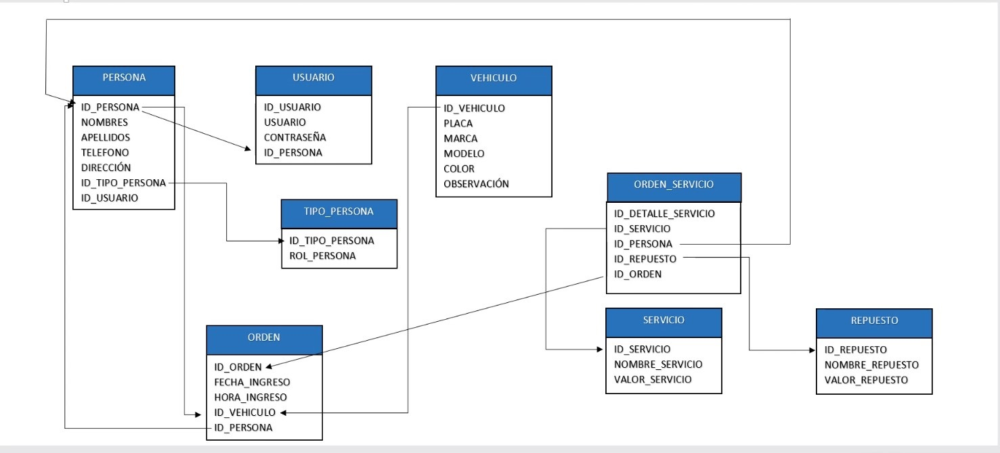

# **PROYECTO CARTIC**

### **CRUD ORDENES DE SERVICIO**

**Endpoints local**
```
http://localhost:8080/api/ordenes_servicios
http://localhost:8080/api/ordenes_servicios/<id>
```
**HEADERS:**
```
{
    Content-Type: application/json,
    Authorization: Bearer eyJhbG...
}

```

**MÉTODOS:** 
```
GET
http://localhost:8080/api/ordenes_servicios
http://localhost:8080/api/ordenes_servicios/<id>

POST
http://localhost:8080/api/ordenes_servicios

{
  "fecha": "2021-10-28",
  "nombreServicio": "secado",
  "descripcionServicio": "servicio de secado con alto costo",
  "placaVehiculo": "HQX482",
  "nombreCliente": "luis paternostro",
  "nombreTecnico": "ellen calcio",
  "valorServicio": 500000.0
}

PUT
http://localhost:8080/api/ordenes_servicios

{
  "id": 2,
  "fecha": "2021-10-28",
  "nombreServicio": "secado",
  "descripcionServicio": "servicio de secado con alto costo",
  "placaVehiculo": "HQX482",
  "nombreCliente": "luis paternostro",
  "nombreTecnico": "ellen calcio",
  "valorServicio": 500000.0
}

DELETE
http://localhost:8080/api/ordenes_servicios/<id>

```

### **.ENV LOCAL**
```
SPRING_DATASOURCE_LOCAL=jdbc:mysql://127.0.0.1:3307/<DATABASE>?createDatabaseIfNotExist=true
SPRING_DB_USERNAME=<USER>
SPRING_DB_PASSWORD=<PASSWORD>
SPRING_AUTO_UPDATE_DB=update
```
### **Entidades**


### **INFO**

[Paquete javax.persistence](https://docs.oracle.com/javaee/7/api/javax/persistence/package-summary.html)